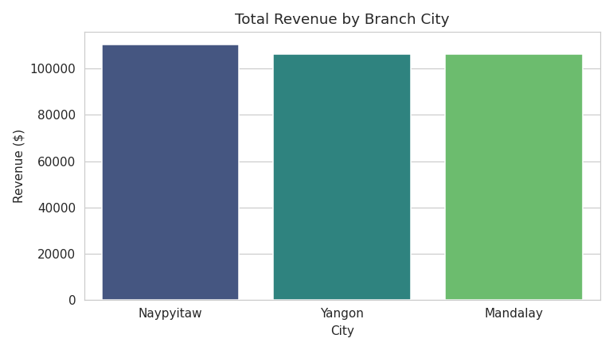
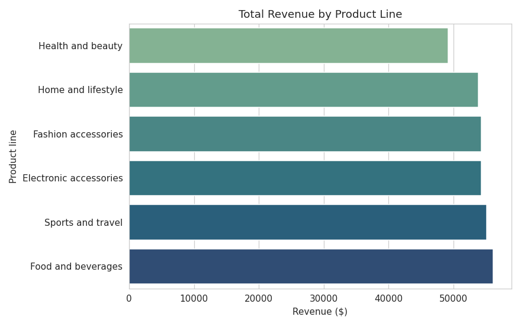
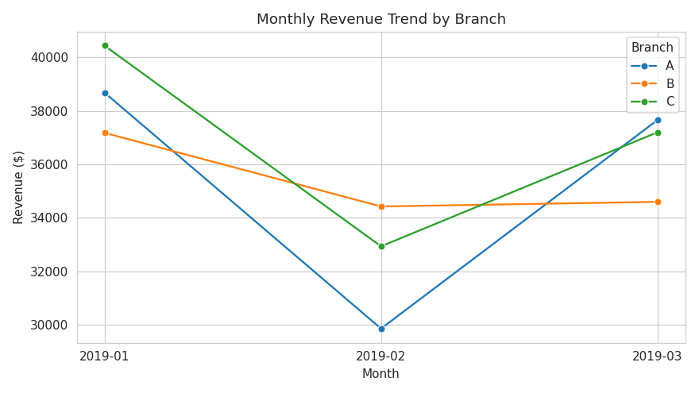
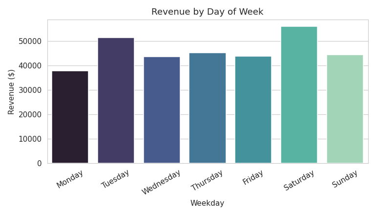
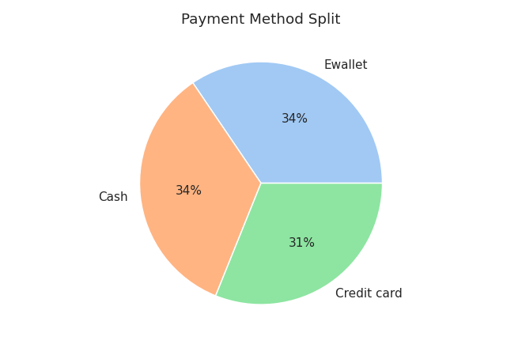
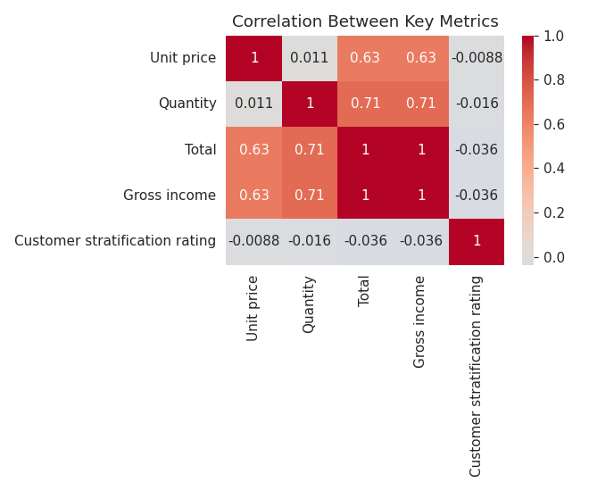

# Supermarket Sales Analysis

A SQL + Python analysis of 1,000 point-of-sale transactions across three supermarket branches, answering: **which branches, product lines, and customer segments drive the most revenue and profit, and what should that mean for staffing, inventory, and marketing?**

## Dataset

1,000 invoices from three branches (Yangon, Mandalay, Naypyitaw), Jan-Mar 2019. Each row includes product line, quantity, unit price, tax, payment method, and customer demographics. ([Source: Supermarket Sales dataset, originally published on Kaggle](https://www.kaggle.com/datasets/aungpyaeap/supermarket-sales))

## Tools

- **SQL (SQLite)** — aggregation and window function queries (`sql/analysis_queries.sql`)
- **Python** (pandas, matplotlib, seaborn) — full analysis and charts (`notebook/analysis.ipynb`)

## Key Findings

- **Naypyitaw** generated the highest total revenue ($110.6K) of the three branches, with Yangon ($106.2K) and Mandalay ($106.2K) close behind — the gap looks more like transaction-mix noise than a location clearly underperforming.
- **Food and beverages** ($56.1K) and **Sports and travel** ($55.1K) are the top two product lines by revenue; **Health and beauty** ($49.2K) trails the rest, suggesting an opportunity for targeted promotions.
- **Saturday is the strongest day** (~$56K) and **Monday the weakest** (~$38K) — a ~48% gap, suggesting staffing and inventory should skew toward the weekend rather than being spread evenly across the week.
- **Ewallet (34.5%), cash (34.4%), and credit card (31.1%)** are used in nearly even proportions, so no single payment rail dominates checkout — all three are worth keeping well-supported at point of sale.
- **Quantity and Total are strongly correlated** (as expected), while **customer satisfaction rating shows almost no correlation with spend** (-0.04) — happier customers don't necessarily spend more per visit, which argues against using satisfaction score alone as a spend predictor.

## Charts

| | |
|---|---|
|  |  |
|  |  |
|  |  |

## Repo Structure

```
retail-sales-analysis/
├── README.md
├── data/
│   └── supermarket_sales.csv
├── sql/
│   └── analysis_queries.sql
├── notebook/
│   └── analysis.ipynb
└── images/
    └── (charts generated by the notebook)
```

## How to Run

```bash
pip install pandas numpy matplotlib seaborn
jupyter notebook notebook/analysis.ipynb
```

Or load `data/supermarket_sales.csv` into any SQL engine and run the queries in `sql/analysis_queries.sql` directly.
